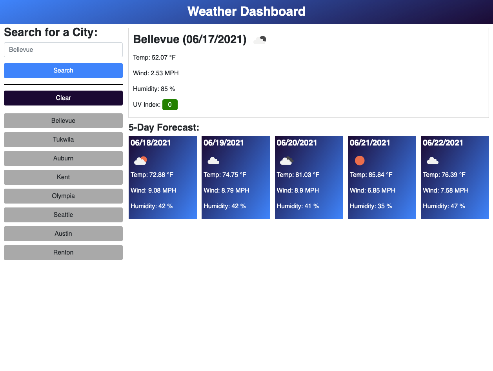

# Weather-App

## Description
This weather dashboard pulls weather data from an API called OpenWeather.
When a user enters a valid city, it will display the current weather and it also forecasts the weather 5 days in advance.

## What was your motivation?
- Utilizing API's that are already out there saved me so much time.
- In my mind I have a clear vision of what I want my work to look like, but I was boggled by the fact that where would I get my data from,
so being able to do this gave me the confidence needed to build more projects that utilizes API's.

## Why did I build this project?
- I wanted to grasp a better understanding of API's, so I created this interface and gained more knowledge about Javascript and APi's.

## What did I learn?
- API's were confusing at first, but after building the code, I slowly started to understood the syntax much more and utilized the API's that are already out there in the world.

## Link to URL
https://dn-vanguard.github.io/Weather-App/

## User Story

```
AS A traveler
I WANT to see the weather outlook for multiple cities
SO THAT I can plan a trip accordingly
```

## Criterias

```
GIVEN a weather dashboard with form inputs
WHEN I search for a city
THEN I am presented with current and future conditions for that city and that city is added to the search history
WHEN I view current weather conditions for that city
THEN I am presented with the city name, the date, an icon representation of weather conditions, the temperature, the humidity, the wind speed, and the UV index
WHEN I view the UV index
THEN I am presented with a color that indicates whether the conditions are favorable, moderate, or severe
WHEN I view future weather conditions for that city
THEN I am presented with a 5-day forecast that displays the date, an icon representation of weather conditions, the temperature, the wind speed, and the humidity
WHEN I click on a city in the search history
THEN I am again presented with current and future conditions for that city
```

## Screenshots



